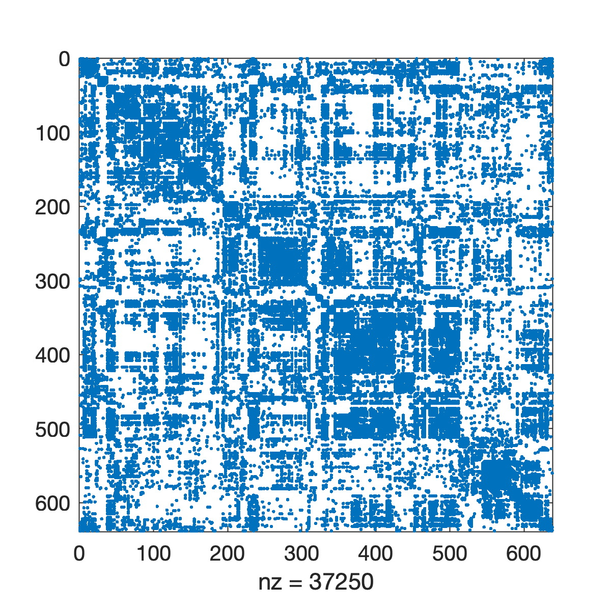
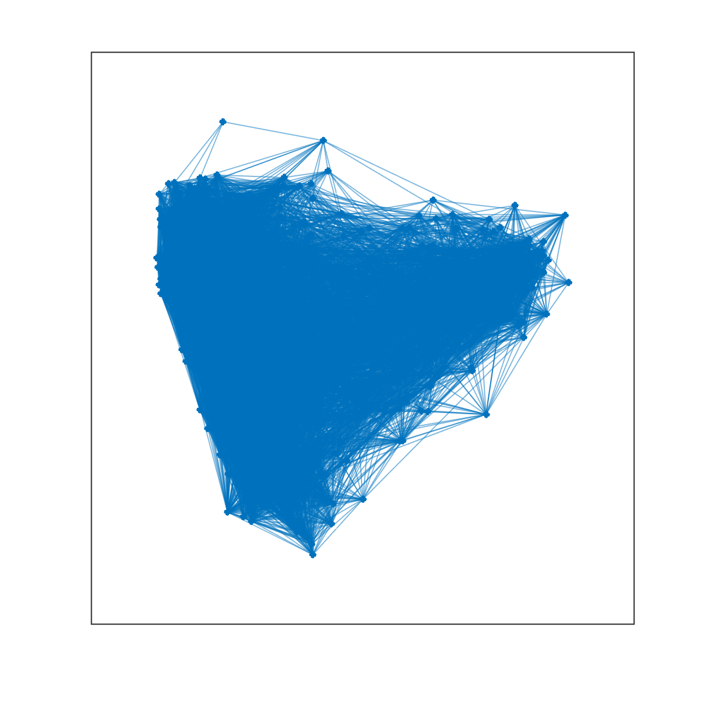
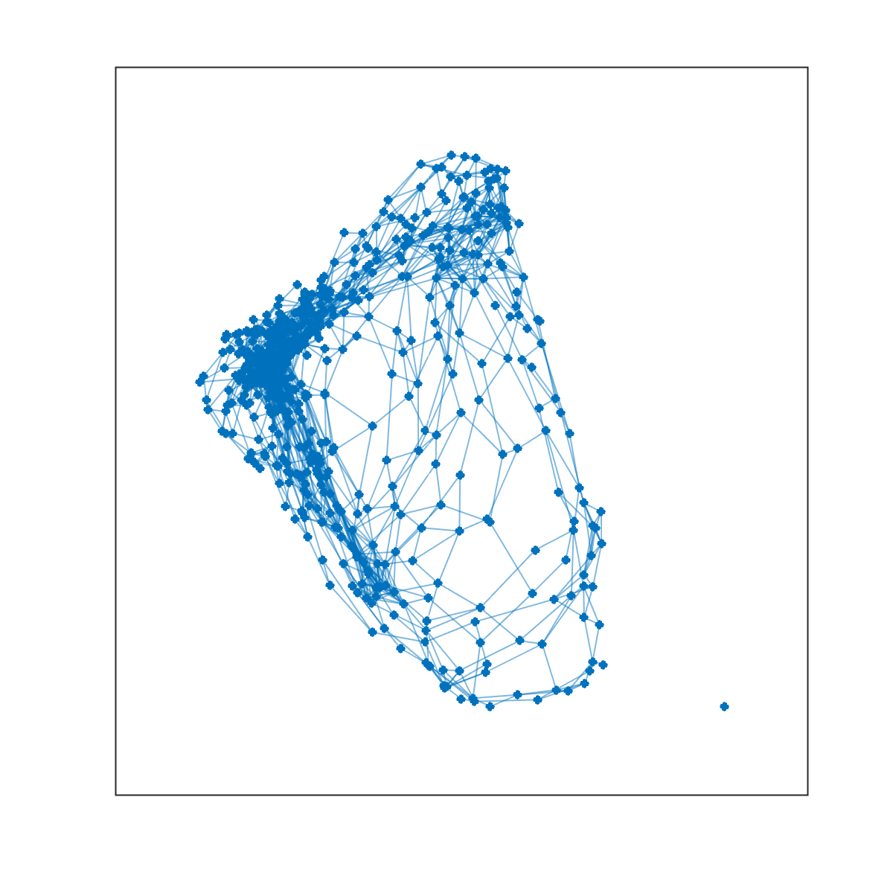

# PSY-P457 Code, data, and examples
This repository contains data, code, and assignments for students enrolled in PSY-P457: Networks in the psychological, cognitive, and brain sciences.

To make your lives easier, I have included a few examples where I illustrate how to perform some basic operations.

1. [How do I load connectivity data?](https://github.com/brain-networks/PSY-P457#how-do-i-load-connectivity-data)
2. [How do I calculate the number of nodes and connections in my network?](https://github.com/brain-networks/PSY-P457#how-do-i-calculate-the-number-of-nodes-and-connections-in-my-network)
3. [How do I calculate the number of connections each node makes?](https://github.com/brain-networks/PSY-P457#how-do-i-calculate-the-number-of-connections-each-node-makes)
4. [How do I calculate global measures like characteristic path length and efficiency?](https://github.com/brain-networks/PSY-P457#how-do-i-calculate-global-measures-like-characteristic-path-length-and-efficiency)
5. [How do I get modules and communities?](https://github.com/brain-networks/PSY-P457#how-do-i-get-modules-and-communities)
6. [When I'm ready to turn in my assignment, what should I give you?](https://github.com/brain-networks/PSY-P457#when-im-ready-to-turn-in-my-assignment-what-should-i-give-you)
7. [How do I visualize my network data?](https://github.com/brain-networks/PSY-P457#how-do-i-visualize-my-network-data)

## How do I load connectivity data?
Datasets that we need for the course are in the <code>data/</code> directory and, unless noted otherwise, stored as <code>.mat</code> files. This file type is specific to MATLAB--you can think of <code>.mat</code> files as bags or boxes in which many variables, including connectivity data, can be stored. When we load a <code>.mat</code> file, we are loading many variables into our workspace.

By default, the datasets included in <code>data/</code> come from the Brain Connectivity Toolbox. Once you've cloned or downloaded this repository, you can create all of your scripts in the <code>m</code> directory. Right now, that directory is empty. If we wanted to load data from a script located in <code>m</code>, we'd write something like:

```Matlab
% load a .mat file from a specific location
load('../mat/Coactivation_matrix.mat')
```

Note here that the <code>../mat/</code> tells MATLAB to go navigate to one directory higher than <code>m</code> and then into the <code>mat</code> directory. It then specifies the exact file to load. In this case, it's one named <code>Coactivation_matrix.mat</code>. If you replaced <code>Coactivation_matrix.mat</code> with <code>mac95.mat</code> then you'd load a different <code>.mat</code> file.

It is also critical that you specify the correct path to the file you're trying to load. For instance, if you wrote:

```Matlab
% load a .mat file from a specific location
load('../directory_x/Coactivation_matrix.mat')
```

and <code>directory_x</code> doesn't exist, then the above command would return an error.

## How do I calculate the number of nodes and connections in my network?
Suppose you've already loaded some data using syntax borrowed from the previous section. Let's also suppose that the variable <code>Cij</code> denotes your connectivity matrix. If we wanted to calculate the number of nodes and connections in the network (irrespective of their weights), we could write the following:

```Matlab
% calculate number of nodes
n_nodes = length(Cij);

% calculate the number of nonzero entries in the matrix
n_edges = nnz(Cij);

% calculate the density of connections (fraction of existing edges divided by total number possible)
dens = density_und(Cij); % <- if your network is undirected
dens = density_dir(Cij); % <- if your network is directed
```

## How do I calculate the number of connections each node makes?
The number of connections a node makes is referred to as its degree. For directed networks, we can further break down this number by parsing degree into the number of incoming and outgoing connections. If we wanted to calculate nodes' degrees, we could use the following functions:

```Matlab
% calculate incoming/outgoing/total degree for each node in a directed network
[degree_in,degree_out,degree_tot] = degrees_dir(Cij);

% do the same for nodes in an undirected network
degrees = degrees_und(Cij);
```
## How do I calculate global measures like characteristic path length and efficiency?
The simplest way to do this for any network is to calculate the shortest paths matrix between all pairs of nodes. Again, supposing our connectivity matrix is <code>Cij</code>, we would write the following:

```Matlab
% calculate distance matrix
D = distance_bin(Cij);

% calculate binary path length and efficiency
[lambda,efficiency] = charpath(D);
```

In the above lines, <code>lambda</code> and <code>efficiency</code> are the path length and efficiency of the network.

The above procedure works for a binary network where edges are either 1 or 0. For weighted networks, we can do something similar, but have to first convert our edge weights from measures of affinity (how much two nodes ``like'' one another) to how costly each edge is. We can do that like so:

```Matlab
% transform weights into costs via an inversion
Cost = 1./Cij;

% calculate weighted distance matrix
D_wei = distance_wei(Cost);

% calculate weighted path length and efficiency
[lambda_wei,efficiency_wei] = charpath(D);
```

## How do I get modules and communities?
There are many algorithms for calculating communities -- the simplest is modularity maximization. It is implemented in the Brain Connectivity Toolbox as the <code>community_louvain</code> function. Unlike other measures, it is *not* deterministic and is instead stochastic. This means that each time you run the algorithm, you might obtain a different result. So we need to develop a way to address this issue, but let's start with the case where we only want to run the algorithm once.

```Matlab
% run modularity maximization for a network where all edge weights are positive
[Ci,Q] = community_louvain(Cij);
```

The above lines of code yields two outputs: <code>Ci</code>, which is a vector of community labels for a each node, and <code>Q</code>, which is a measure of the community quality -- i.e. how good the communities are.

As I noted earlier, the <code>community_louvain</code> function is stochastic (you can convince yourself of this by running the algorithm twice and then manually comparing the cluster labels against one another). Ideally, what we want to do is run the algorithm *many* times and somehow average the slightly dissimilar results together to obtain a set of consensus clusters. This is more involved, but you can do it using the <code>consensus_und</code> function:

```Matlab
% number of times to repeat community detection algorithm
num_iter = 100;

% number of nodes
n_nodes = length(Cij);

% empty array for storing the community labels
Ci = zeros(n_nodes,num_iter);

% run the community detection algorithm num_iter times
for iter = 1:num_iter
  Ci(:,iter) = community_louvain(Cij);
end

% calculate the module coassignment matrix -- for every pair of nodes
% how many times were they assigned to the same community
Coassignment = agreement(Ci)/num_iter;

% node we use the consensus clustering function
thr = 0.5;
cicon = consensus_und(Coassignment,thr,num_iter);
```

The consensus clustering function is useful--it discards weights below a value of <code>thr</code> and then directly clusters the module coassignment matrix <code>Coassignment</code>. Because the modules are almost always better defined in this matrix than in <code>Cij</code>, they will be easier to detect and the algorithm tends to converge to a partition that emphasizes co-assignments that are consistently observed in the initial set of detected partitions, <code>Ci</code>.

## How do I visualize my network data?
There are a few strategies for visualizing network data. For instance, we can visualize the connectivity matrix using the <code>imagesc</code> command. This command shows the connectivity matrix as a ``grid'' -- the strongest connections are assigned warm colors while non-existent or weak connections are assigned cooler colors. Again, supposing our connectivity data is defined by <code>Cij</code>. In fact, let's make this concrete and use the coactivation matrix from before:

```Matlab
% load the macaque dataset
load('../mat/Coactivation_matrix.mat');

% here, the connectivity matrix is named "Coactivation_matrix", so for the same of continuity, let's just rename it as Cij
Cij = Coactivation_matrix;

% create a figure and use imagesc to visualize the matrix
f = figure;
imagesc(Cij);
```


If our network is binary and sparse (only a small fraction of possible connections exist), we can also use the <code>spy</code> command to just highlight connections that exist versus those that do not.

```Matlab
% create a figure and use spy to visualize the matrix
f = figure;
spy(Cij);
```


Matlab also gives us the ability to use ``force-directed'' layouts for visualizing our network. The algorithms for generating these layouts imagine that edges are springs and they choose 2D coordinates for each node so as to minimize the spring potential energy of the system.

```Matlab
% create a graph object
g = graph(Cij);

% create a figure and use plot to visualize the network
f = figure;
plot(g);
```


Note that the above figure is very dense and difficult to make much sense of. This is because there are many connections displayed simultaneously, many of which are weak. We can threshold the network and repeat this process, hopefully generating a clearer image.

```Matlab
% threshold the network so that it has 1% connection density
Cij_thresh = threshold_proportional(Cij,0.01);

% create a graph object
g = graph(Cij_thresh);

% create a figure and use plot to visualize the network
f = figure;
plot(g);
```



## When I'm ready to turn in my assignment, what should I give you?
The preferred procedure is as follows. Open your script in MATLAB, click on the <code>Publish</code> tab at the top of the screen. Then press the <code>Publish</code> button (a green ``play'' arrow on top of what looks like an envelop). This will convert your script into an <code>html</code> file. Within the file, it will embed images, code, and comments that were generated as part of your script. Compress/zip those files together and submit them on Canvas. *Note: Always check to make sure that the published file contains all the outputs I need to evaluate your submission. For instance, not just the images/figures, but also comments and numerical output.*

However, if you have any issue with the publication procedure, you're always welcome to submit the <code>.m</code> file directly. It's a riskier, because then I have to run the code on my own computer and might be missing dependencies, files you load might not be in the same place on my computer as they are on yours, and (in general) more likely to result in errors.

But either option is totally fine!
